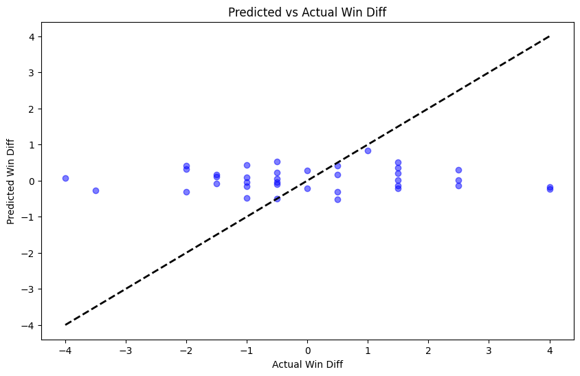
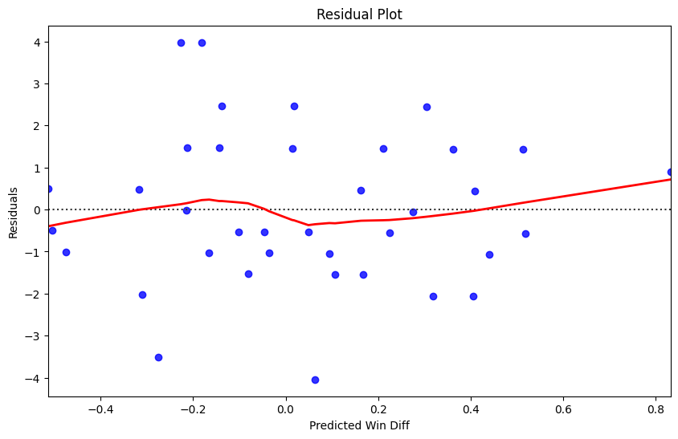
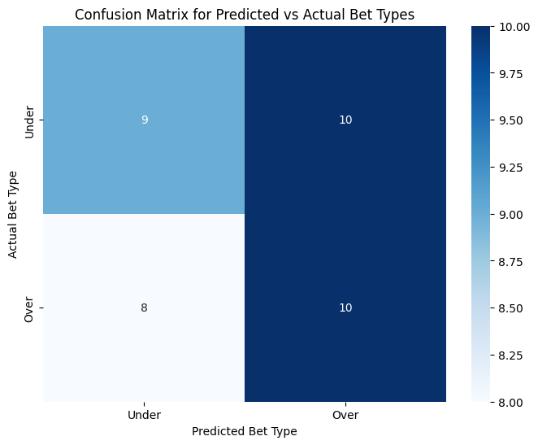

# Tail Me - Team 46 ML Midterm

## Problem Definition

Unlike professional sports, college football is a collection of nearly 150 teams - many of whom don't receive national attention. For many of these programs, local media outlets dominate their news coverage. In the context of sports betting, lines and odds are set by outsiders on a national scale. Thus, much of the underlying information about a team may be captured by local media and kept a "secret" to these oddsmakers. We aim to explore how capturing local news sentiments can help us provide better context unknown at the national level and more accurately predict the outcome of a college football team's season. Others have tried approaches at the individual level (i.e., social media) to predict outcomes for sports and similar topics; however, the concept of looking one level at local news is relatively unexplored [IEEE Explore](https://ieeexplore.ieee.org/document/8530517) and [MDPI](https://www.mdpi.com/2624-831X/1/2/14).

To do this, we examine local news articles about division 1 college football teams before a season and compare it against national odds predicting how well that team will do that year. We web scrape local articles and compare them against a dataset of odds for the 2023 season available at [Sports Odds History](https://www.sportsoddshistory.com/cfb-win/?y=2023&sa=cfb&t=win&o=t).

## Problem Definition
### Problem
Explore if article sentiments from local news can provide insight to team performance in the upcoming season in college football.

### Motivation
Local news is the dominant outlet for many smaller college football programs and may be kept a secret or inaccurately judged by national oddsmakers in college football.

## Methods

### Data Preprocessing Methods
- We start by gathering the dataset, done by webscraping local news articles in a specified format for all division one teams, aiming for around 10 articles per team. We extract the title and article content of each of these links and export it to a csv.
- Next, we **filter out bad articles**
  *   First we **embed all of the titles** of the articles using a hugging face sentence embedding model. We then compare it against a set query and use cosine simililarty of the two embeddings in order to determine whether to drop the article or not. It is worth noting we artifically bump up some of the titles that contain certain keywords (i.e preview, predictions) in order to not incorrectly drop some of the articles.
  *   We also drop all articles that could not be parsed correctly
 - We then webscrape the odds database for all the teams, concatenating it with the dataframe of the articles to create a singular dataframe

### Models
There are two main models we implemented so far.
1. Sentiment Analysis
- We take all of the valid articles and their contents and score them from -1 to 1 on sentiment using a hugging face sentiment analysis model. We do this for each article for each team, followed by averaging them out for each team. The goal of this is to capture the overall sentiment of local news for the given team. Sentiment analysis is a supervised NLP technique that (as the name implies) captures the sentiment of the given text. No preprocessing of the text was required as it is a transformer based model that takes capitalization, punctuation, stopwords, etc. into account; as long as the article content was correctly scraped we passed it in as is. 
2. Linear regression
- We then apply linear regression, using the sentiment scores for each team as the independent variable and the win differential (calculated as actual wins minus predicted wins) as the dependent variable. We do this method with a continuous outcome rather than simply predicting over and under in order to get a more accurate model. Using over/under as the outcome (binary, would have used logisitic regression) would have ignored many of the naunces associated with each data point. Thus, we opted to use a continuous variable as the outcome and then afterwards convert this to a binary over/under prediction for comparison in order to be more precise.

## Results and Discussion

**Scores:**
- **Mean Squared Error:** 3.3171764072001624
- **R-squared:** -0.02545207213662004
- **Accuracy:** 0.5135135135135135

- This is a basic plot of our linear regression model (sentiment of articles versus actual-predicted win loss difference)
- Trendline is relatively steep, and the datapoints are at a similar level. Correlation is very subtle.
- However, a steep trendline doesn't necessarily mean a good fit, indicated by the negative R-squared and relatively high MSE.

- This is a residual plot for the linear regression model.
- There seems to be little to no clear pattern in the graph except for outliers towards the high end of the win total. Overall, this is a good sign there is no clear section of bias in our model and is without being influenced by any specific bias.

- The model is ever so slightly predicting over more than under, but overall pretty even. There is little trend here as there should be. This is good to know as we likely do not have to adjust the threshold to predict over or under (derived from predicted wins).

### Conclusions
The model is doing slightly better than guessing (51.3% over 50%) which is to be expected given that sentiment analysis of articles is likely to be no more than a small trend. This, coupled with the use of a basic model such as linear regression, was bound to only give a marginal increase over guessing, especially as sports betting is unfavorable to begin with. However, coupling this with other paramters could yield a much stronger model which we will explore in the futute.

